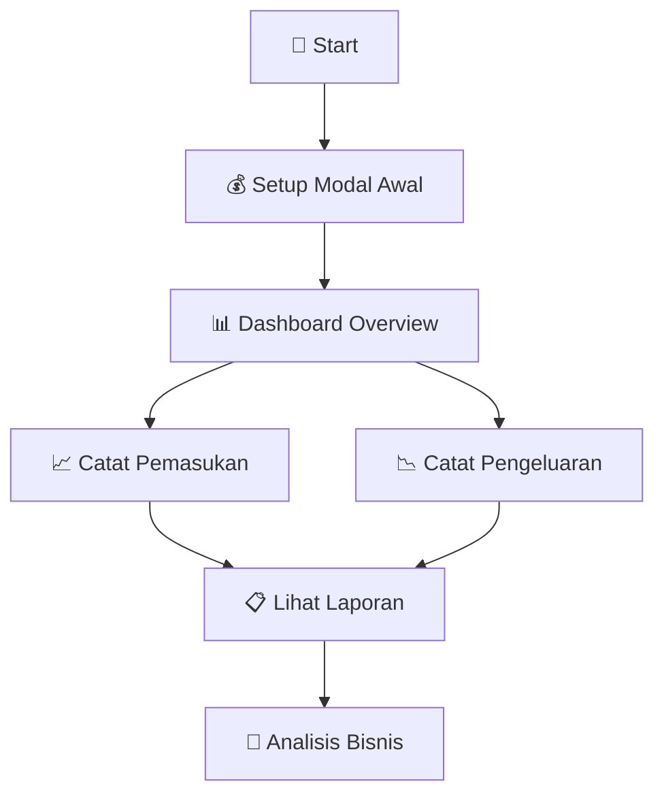

# 💰 Modal Management App

<div align="center">


**Aplikasi manajemen keuangan sederhana dan powerful untuk mengelola modal bisnis Anda**

[Screenshots](#-screenshots) • [Fitur](#-fitur-utama) • [Instalasi](#-quick-start) • [Demo](#-demo)

</div>

---

## 🖼️ Screenshots

<div align="center">
  
</div>

## ✨ Fitur Utama

<table>
<tr>
<td width="50%">

### 📊 **Dashboard Keuangan**
Ringkasan lengkap modal, pemasukan, pengeluaran, dan analisis laba/rugi real-time

### 💳 **Manajemen Modal** 
Kelola modal awal bisnis dengan mudah dan fleksibel

### 📈 **Pencatatan Pemasukan**
Catat semua transaksi pemasukan dengan kategori yang terorganisir

</td>
<td width="50%">

### 📉 **Monitor Pengeluaran**
Pantau dan catat semua pengeluaran operasional bisnis

### 📋 **Laporan Detail**
Analisis mendalam dengan filter periode dan visualisasi data

### 🎨 **Interface Modern**
UI yang clean, intuitive, dan mudah digunakan

</td>
</tr>
</table>

## 🛠️ Tech Stack

<div align="center">

| Category | Technology |
|----------|------------|
| **Framework** |  |
| **Database** |  |
| **Language** |  |
| **Storage** | sqflite package |
| **State Management** | Provider / Bloc |

</div>

## 🚀 Quick Start

### 📋 Prerequisites

```bash
✅ Flutter SDK (3.0+)
✅ Dart SDK  
✅ Android Studio / VS Code
✅ Android SDK
```

### ⚡ Installation

```bash
# 1️⃣ Clone repository
git clone https://github.com/username/modal-management-app.git
cd modal-management-app

# 2️⃣ Install dependencies
flutter pub get

# 3️⃣ Run the app
flutter run
```

## 🎯 How to Use

<div align="center">



</div>

| Step | Action | Description |
|------|--------|-------------|
| 1️⃣ | **Setup Modal** | Tambahkan modal awal bisnis Anda |
| 2️⃣ | **Input Pemasukan** | Catat semua pemasukan harian |
| 3️⃣ | **Monitor Pengeluaran** | Pantau pengeluaran operasional |
| 4️⃣ | **Dashboard** | Lihat ringkasan keuangan real-time |
| 5️⃣ | **Analisis** | Gunakan filter untuk insight mendalam |

## 🏗️ Build Production

<div align="center">

### Android Builds

</div>

```bash
# 📱 Build APK
flutter build apk --release

# 📦 Build App Bundle (Recommended for Play Store)
flutter build appbundle --release
```

## 🎨 Features Preview

<div align="center">

| Feature | Status | Description |
|---------|--------|-------------|
| 📊 Dashboard | ✅ | Real-time financial overview |
| 💰 Modal Management | ✅ | Capital tracking |
| 📈 Income Tracking | ✅ | Revenue monitoring |
| 📉 Expense Management | ✅ | Cost control |
| 📋 Reports | ✅ | Detailed analytics |
| 🌙 Dark Mode | 🚧 | Coming soon |
| 📤 Export Data | 🚧 | Coming soon |
| 🔔 Notifications | 🚧 | Coming soon |

</div>

## 🤝 Contributing

Kontribusi selalu welcome! Berikut cara berkontribusi:

1. Fork repository ini
2. Buat branch fitur (`git checkout -b feature/AmazingFeature`)
3. Commit perubahan (`git commit -m 'Add some AmazingFeature'`)
4. Push ke branch (`git push origin feature/AmazingFeature`)
5. Buka Pull Request

## 📄 License

<div align="center">

Distributed under the **MIT License**. See [`LICENSE`](LICENSE) for more information.

[](https://opensource.org/licenses/MIT)

</div>

## 👨‍💻 Developer

<div align="center">

**BangJepp56**

[](https://github.com/BangJepp56)
[](mailto:bangjepp56@gmail.com)

</div>

## 🙏 Acknowledgments

- 📚 [Flutter Documentation](https://flutter.dev/docs) - Amazing framework docs
- 🗃️ [SQLite Documentation](https://www.sqlite.org/docs.html) - Reliable database docs  
- 🎨 [Icons8](https://icons8.com) - Beautiful icons collection
- 💡 Community contributors and testers

---

<div align="center">

### ⭐ Star this repo if it helps you!

**Made with by BangJepp56**

[](https://star-history.com/#BangJepp56/modal-management-app&Date)

</div>
