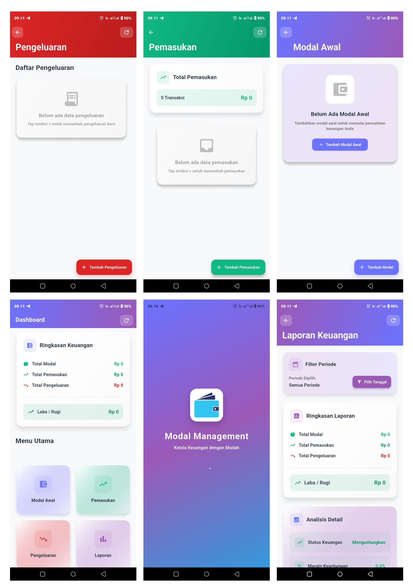

# Modal Management App

Aplikasi manajemen keuangan sederhana yang dibangun dengan Flutter dan SQLite untuk membantu mengelola modal, pemasukan, pengeluaran, dan laporan keuangan.

## 📱 Screenshots



## ✨ Fitur Utama

- **Dashboard Keuangan**: Ringkasan lengkap modal, pemasukan, pengeluaran, dan laba/rugi
- **Manajemen Modal**: Tambah dan kelola modal awal bisnis
- **Pencatatan Pemasukan**: Catat semua transaksi pemasukan dengan mudah
- **Pencatatan Pengeluaran**: Monitor dan catat semua pengeluaran
- **Laporan Keuangan**: Analisis detail dengan filter periode dan status keuangan
- **Interface Modern**: UI yang clean dan mudah digunakan
- **Offline Support**: Bekerja tanpa koneksi internet menggunakan SQLite

## 🛠️ Teknologi yang Digunakan

- **Framework**: Flutter
- **Database**: SQLite
- **State Management**: Provider / Bloc (sesuai implementasi)
- **Local Storage**: sqflite package

## 🚀 Instalasi dan Setup

### Prasyarat
- Flutter SDK (versi 3.0 atau lebih baru)
- Dart SDK
- Android Studio / VS Code
- Android SDK untuk testing di Android

### Langkah Instalasi

1. **Clone repository**
   ```bash
   git clone https://github.com/username/modal-management-app.git
   cd modal-management-app
   ```

2. **Install dependencies**
   ```bash
   flutter pub get
   ```

3. **Jalankan aplikasi**
   ```bash
   flutter run
   ```

## 🎯 Cara Penggunaan

1. **Setup Modal Awal**: Tambahkan modal awal bisnis Anda
2. **Catat Pemasukan**: Input semua pemasukan harian
3. **Catat Pengeluaran**: Monitor pengeluaran operasional
4. **Lihat Dashboard**: Pantau ringkasan keuangan real-time
5. **Analisis Laporan**: Gunakan filter periode untuk analisis mendalam

## 🚀 Build untuk Production

### Android APK
```bash
flutter build apk --release
```

### Android App Bundle
```bash
flutter build appbundle --release
```

## 📄 Lisensi

Distributed under the MIT License. See `LICENSE` for more information.

## 👨‍💻 Developer

**Your Name**
- GitHub: [@BangJepp56](https://github.com/BangJepp56)
- Email: bangjepp56@gmail.com

## 🙏 Acknowledgments

- [Flutter Documentation](https://flutter.dev/docs)
- [SQLite Documentation](https://www.sqlite.org/docs.html)
- Icons dari [Icons8](https://icons8.com)

---

⭐ Jangan lupa kasih star jika project ini membantu!
